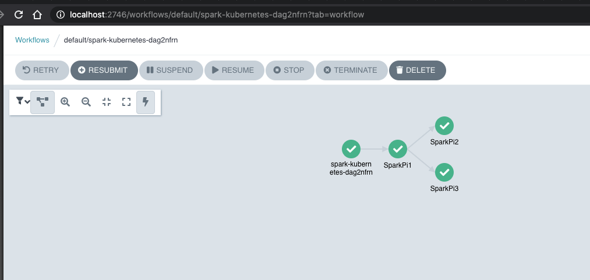

# Spark on Kubernetes 
The aim of this repo is show some samples about how to launch and orchestrate Spark jobs on Kubernetes

The main points of this repo are: 
* Localhost deployment: Kind 
* Build Spark job as Docker image
* Platform Applications Deployments 
* Spark Applications Deployments 
* Vanilla k8s
* How to orchestrate the Spark jobs on Kubernetes: Argo Workflows

Besides, you can follow the [slides](Running%20Spark%20on%20Kubernetes.pdf) for the [K8s Days Spain 2021](https://kcdspain.com/)


## Deploy cluster localhost
* Deploy Kind cluster 
* Deploy Nginx Ingress

```sh
kind create cluster --config=kind/cluster-conf.yaml

kubectl apply -f https://raw.githubusercontent.com/kubernetes/ingress-nginx/master/deploy/static/provider/kind/deploy.yaml

kubectl wait --namespace ingress-nginx \ 
  --for=condition=ready pod \
  --selector=app.kubernetes.io/component=controller \
  --timeout=90s

```

## Build image 
A build sample can be found in the next repo:
https://github.com/aws-samples/amazon-eks-apache-spark-etl-sample
 
```sh 
git clone git@github.com:empathyco/amazon-eks-apache-spark-etl-sample.git

cd amazon-eks-apache-spark-etl-sample

docker build --target=spark -t k8s-test/spark:v2.4.4 .

docker build -t k8s-test/spark-on-localhost:v1.0 .

```

Now the image should be load to kind as follows: 

```sh
kind load docker-image k8s-test/spark:v2.4.4

kind load docker-image k8s-test/spark-on-localhost:v1.0
```

A Docker image with Prometheus and aws-hadoop

```
cd ./spark-docker
docker build -t k8s-test/spark-prometheus:v1.6 .
kind load docker-image k8s-test/spark-prometheus:v1.6
```

## Platform Applications Deployments 

* [ArgoCD](applications/argocd/values.yaml)
* [platform-apps](deployments/applications/platform/argo-apps.yaml)
  * [Argo-Workflows](applications/platform/argo-workflows/values.yaml)
  * [Spark Operator](applications/platform/spark-operator/values.yaml)
  * [kube-prometheus-stack](applications/platform/spark-operator/values.yaml)

ArgoCD

```sh
cd ./applications/argocd
helm install argocd . -f values.yaml
```
ArgoCD will be deployed 

```sh
kubectl apply -f ./deployments/applications/platform/argo-apps.yaml
```

All the platform applications will be created on ArgoCD

  
## Spark Applications Deployments 
* [Spark-apps](deployments/applications/spark-apps/argo-apps.yaml)
  * [hello-spark-submit](applications/spark-apps/hello-spark-submit/test-job-example.yaml)
  * [hello-spark-operator](applications/spark-apps/hello-spark-operator/spark-application.yaml)
  * [hello-argo-workflows](applications/spark-apps/hello-argo-workflows/hello-world-dag.yaml) 
  * [hello-spark-operator-argo-workflows](applications/spark-apps/hello-spark-operator-argo-workflows/spark-operator-kubernetes-dag.yaml)
  * [hello-argo-workflow-template](applications/spark-apps/hello-argo-workflow-template/hello-argo-workflow-template.yaml)
  * [spark-history-server](applications/spark-apps/spark-history-server/values.yaml)
  * [hello-spark-operator-history](applications/spark-apps/hello-spark-operator-history/spark-application.yaml)

```sh 
kubectl apply -f ./deployments/applications/spark-apps/argo-apps.yaml
```

## Vanilla K8s

### Spark on Kubernetes

#### Spark submit

It's the easiest way to run Spark on Kubernetes

```sh
# Check all possible clusters, as your .KUBECONFIG may have multiple contexts:
kubectl config view -o jsonpath='{"Cluster name\tServer\n"}{range .clusters[*]}{.name}{"\t"}{.cluster.server}{"\n"}{end}'

# Select name of cluster you want to interact with from above output:
export CLUSTER_NAME="some_server_name"

# Point to the API server referring the cluster name
APISERVER=$(kubectl config view -o jsonpath="{.clusters[?(@.name==\"$CLUSTER_NAME\")].cluster.server}")

# Gets the token value
TOKEN=$(kubectl get secrets -o jsonpath="{.items[?(@.metadata.annotations['kubernetes\.io/service-account\.name']=='default')].data.token}"|base64 --decode)

# Explore the API with TOKEN
curl -X GET $APISERVER/api --header "Authorization: Bearer $TOKEN" --insecure
```

The output is similar to this: 

```json 
{
  "kind": "APIVersions",
  "versions": [
    "v1"
  ],
  "serverAddressByClientCIDRs": [
    {
      "clientCIDR": "0.0.0.0/0",
      "serverAddress": "172.18.0.2:6443"
    }
  ]
}
```

Where serverAddress will be the APISERVER_IP for K8s in the example folder

```sh 
kubectl apply -f spark-submit/test-sa.yaml

kubectl apply -f spark-submit/test-job-example.yaml

kubectl apply -f spark-submit/test-job-eks.yaml (From localhost it fails because IAM roles permissions)
```

#### Spark Operator 

Project status in beta, more info can be found in:
[https://github.com/GoogleCloudPlatform/spark-on-k8s-operator](https://github.com/GoogleCloudPlatform/spark-on-k8s-operator)

```sh
helm repo add spark-operator https://googlecloudplatform.github.io/spark-on-k8s-operator

helm install my-release spark-operator/spark-operator --namespace spark-operator --create-namespace

kubectl apply -f spark-operator/spark-application.yaml
```

#### Spark UI 
```sh
kubectl port-forward spark-driver-po 4040:4040
```

#### Argo Workflows 

Some Highlights: 
* API Rest to submit, get and delete workflows
* Suspend execution, either for a duration or until it is resumed manually.
* Directed Acyclic Graph (DAG): A set of steps and the dependencies between them
* Workflow Template: a Kubernetes resource defining a reusable workflow for a namespace
* Some more important features: https://github.com/argoproj/argo#features


Installation and orchestrate two sequential Spark jobs in localhost.

To be able to run Argo Workflow is needed to change the containerRuntimeExecutor to k8sapi  [GitHub Issue](https://github.com/argoproj/argo/issues/2557#issuecomment-607239438)

More info in: 
* https://github.com/argoproj/argo/blob/master/docs/workflow-executors.md


```sh
kubectl create namespace argo

kubectl apply -n argo -f https://raw.githubusercontent.com/argoproj/argo/stable/manifests/install.yaml

kubectl -n argo apply -f argo-workflows/argo-cm.yaml

kubectl -n default apply argo-workflows/argo-workflows-sa.yaml

kubectl -n argo port-forward deploy/argo-server 2746:2746

```

Some examples: 
```sh 
kubectl create -f argo-workflows/hello-world-dag.yaml

kubectl create -f argo-workflows/spark-kubernetes-dag.yaml

```
Hitting http://localhost:2746 the workflows can be found out



# Slides 

[Here](Running%20Spark%20on%20Kubernetes.pdf)

# References
* https://github.com/GoogleCloudPlatform/spark-on-k8s-operator
* https://spark.apache.org/docs/latest/running-on-kubernetes.html 
* https://medium.com/@surajrajanathrapully/implementing-and-integrating-argo-workflow-and-spark-on-kubernetes-aaada016c803
* https://argoproj.github.io/argo/
* http://www.diva-portal.org/smash/get/diva2:1259247/FULLTEXT01.pdf
* https://blog.lunatech.com/2019/01/running-the-spark-notebook-on-a-kubernetes-google-cloud-cluster/
* https://github.com/apache/spark/tree/master/resource-managers/kubernetes/docker/src/main/dockerfiles/spark
* https://aws.amazon.com/blogs/containers/optimizing-spark-performance-on-kubernetes/
* https://godatadriven.com/blog/spark-kubernetes-argo-helm/
* https://github.com/aws-samples/amazon-eks-apache-spark-etl-sample 
* https://itnext.io/migrating-apache-spark-workloads-from-aws-emr-to-kubernetes-463742b49fda
* https://youtu.be/rpN9IsihEKI